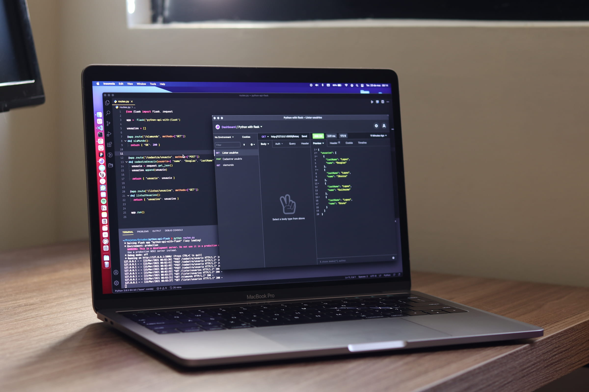

import imageChelseaHagon from '@/images/team/chelsea-hagon.jpeg'
import imageEmmaDorsey from '@/images/team/emma-dorsey.jpeg'

export const article = {
  date: '2023-04-06',
  title: 'Unlocking Insights: Using Your Data to Power AI Chatbots',
  description:
   'Discover how leveraging your data in AI chatbots can unlock predictive capabilities, revolutionizing customer interactions and shaping business strategies for success.',
   author: {
    name: 'Valdemar Østergaard',
    role: 'Associate Product Specialist',
    image: { src: imageEmmaDorsey },
  },
}

export const metadata = {
  title: article.title,
  description: article.description,
}

In the world of modern business, data is more than just numbers – it's the key to informed decision-making and future success. Now imagine if this treasure trove of information could be harnessed to create AI chatbots that not only respond to queries but predict user needs before they even arise. With Seek's AI-powered technology, this isn't just a futuristic dream – it's a reality that's transforming customer interactions and business strategies alike.

## 1. Data as the Fuel for Predictive AI

AI chatbots are no longer limited to scripted responses. By integrating your own data – from customer interactions to historical trends – these digital assistants can harness the power of machine learning to predict user behavior. This means that instead of simply reacting to inquiries, AI chatbots can anticipate user needs and offer proactive solutions.

In 2023 we can expect these assistants to become more sophisticated and for that to have ripple effects throughout the industry.

We predict that traffic to MDN will decline precipitously as developers realise they no longer need to look up JS array methods. We also expect Stack Overflow’s sister site, Prompt Overflow, to become one of the most popular sites on the internet in a matter of months.

## 2. Revolutionizing Customer Interactions

Imagine a scenario where a customer contacts your support chatbot with a query about a product. Instead of providing a standard response, the chatbot analyzes the user's data history, purchase behavior, and preferences to predict their specific needs. It then offers tailored recommendations, creating an experience that feels personalized and attentive.

## 3. Shaping Strategies with Data-Driven Insights

The insights derived from predictive AI chatbots extend beyond customer interactions. Businesses can leverage this data to inform their strategies, from marketing campaigns to product development. By analyzing patterns and trends, companies can proactively adapt to changing market dynamics and stay ahead of the competition.

## 4. The Path to Future Success

Predictive capabilities don't just enhance the present – they pave the path to future success. As AI chatbots continue to learn from data and refine their predictions, their value to businesses grows exponentially. They become trusted advisors that guide decisions, optimize operations, and create experiences that customers truly appreciate.

## Embrace the Power of Prediction with Seek

Incorporating your data into AI chatbots is a game-changing strategy that unlocks the potential for predictive capabilities. With Seek's technology, businesses can elevate customer interactions, shape strategies with data-driven insights, and set the stage for a future of innovation and success. Embrace the power of prediction with Seek and witness how data transforms into a driving force for excellence.
